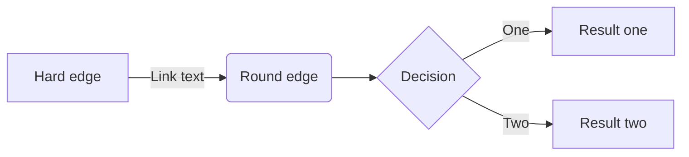
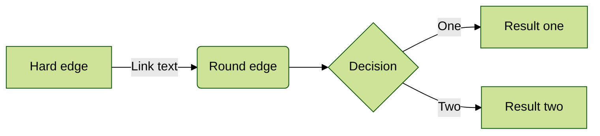
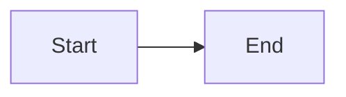

Retype provides several components for presenting code and technical content: fenced code blocks with rich options, file-based snippets, Mermaid diagrams, and LaTeX math formulas.

## Code blocks

Wrap code in triple backticks to create a code block.

````md
```
A basic code block
```
````

### Syntax highlighting

Add a language identifier after the opening fence to enable syntax highlighting. Retype uses [PrismJS](https://prismjs.com/) and supports all Prism languages.

````md
```js
const msg = "hello, world";
```
````

### Title

Add a title by placing text after the language identifier, separated by a space.

````md
```js My title
const msg = "hello, world";
```
````

### Line numbers

Add `#` after the language identifier to enable line numbers.

````md
```js #
const msg = "hello, world";
```
````

Combine a line number specifier with a title:

````md
```js # Your title here
const msg = "hello, world";
```
````

To disable line numbers on a block when they are enabled site-wide via `snippets` config, use `!#`:

````md
```js !#
const msg = "hello, world";
```
````

Line numbers can also be enabled for all blocks of a given language across the project via the `snippets` config in `retype.yml`:

```json Enable line numbering for js and json blocks site-wide
{
  "snippets": {
    "lineNumbers": ["js", "json"]
  }
}
```

### Line highlighting

Highlight specific lines by adding a `#` followed by a line number or range after the opening fence.

| Scenario | Syntax | Description |
| --- | --- | --- |
| Single line | `#2` | Highlight line 2 |
| Line range | `#2-5` | Highlight lines 2 to 5 |
| Multiple ranges | `#2-3,5-7` | Highlight lines 2–3 and 5–7 |
| No line numbers | `!#2-3,5-7` | Highlight without showing line numbers |

````md
```js #2
const a = 1;
const b = 2;  // highlighted
const c = 3;
```
````

Alternatively, use the `highlight` attribute syntax:

````md
```js:highlight="2-3,5-7"
// code here
```
````

### Custom attributes

Apply a custom `id` or CSS `class` to a code block using the `{#id .class}` syntax.

````md
```js {#example-code .highlight}
const msg = "hello, world";
```
````

### Search index

By default, code block content is included in the site search index. To exclude all code blocks from search results, set `excludeCode` in your `retype.yml`:

```yaml retype.yml
search:
  excludeCode: true
```

## Code groups

Group multiple code blocks into a tabbed interface using the `+++` Tab component. Each block becomes a separate tab.

````md
+++ JavaScript
```js
console.log("Hello, world!");
```
+++ TypeScript
```ts
console.log("Hello, world!");
```
+++ Python
```py
print('Hello, world!')
+++
````

<Tip>
For full Tab component documentation including anchors and custom attributes, see [Layout components](/components/layout).
</Tip>

## Code snippets

A code snippet includes the content of an external file (or a portion of it) directly into a code block. This is useful for keeping documentation in sync with actual source code.

```md
:::code source="path/to/file.js" :::
```

### Source

The `source` attribute is the path to the file, relative to the current document. The file must be accessible when Retype builds the project.

```md
:::code source="../src/example.js" :::
```

### Range

Include only specific lines using the `range` attribute. Accepts individual line numbers, dash-separated ranges, or comma-separated combinations.

```md
:::code source="../src/example.js" range="1-2" :::
```

```text
range="2"           // Single line
range="2-24"        // Range of lines
range="2,12-24,26" // Combination
```

### Title

An optional title can be displayed above the code block.

```md
:::code source="../src/example.js" range="1-2" title="../src/example.js" :::
```

### Language

Retype automatically detects the language from the file extension. You can override it with the `language` attribute.

```md
:::code source="../src/example.js" language="typescript" :::
```

### Region (C# only)

For `.cs` files, use the `region` attribute to include only the lines between a named `#region` / `#endregion` pair.

```md
:::code source="../src/MyClass.cs" region="validation" :::
```

## Mermaid diagrams

[Mermaid](https://mermaid-js.github.io/mermaid) diagrams are created using a fenced code block with the `mermaid` language specifier.

````md

````

### Directives

Mermaid [directives](https://mermaid-js.github.io/mermaid/#/directives) can be applied using the `%%{init: { }}%%` syntax as the first line of the block.

````md

````

### Syntax highlighting only

To display Mermaid source code with syntax highlighting instead of rendering it as a diagram, use the `mermaid-js` specifier.

````md

````

### Supported diagram types

| Type | Specifier |
| --- | --- |
| Flowchart | `graph LR` / `graph TD` |
| Sequence diagram | `sequenceDiagram` |
| Gantt chart | `gantt` |
| Class diagram | `classDiagram` |
| Entity relationship | `erDiagram` |
| User journey | `journey` |
| Kanban | `kanban` |
| Sankey | `sankey-beta` |
| Architecture | `architecture-beta` |
| XY chart | `xychart-beta` |

## Math formulas

Retype renders LaTeX math expressions using [KaTeX](https://katex.org/). All KaTeX syntax is supported.

### Inline formulas

Wrap an expression in single `$` characters to render it inline with surrounding text.

```md
The formula $E = mc^2$ is rendered inline.
```

```latex Inline formula example
$\displaystyle \left( \sum_{k=1}^n a_k b_k \right)^2 \leq \left( \sum_{k=1}^n a_k^2 \right) \left( \sum_{k=1}^n b_k^2 \right)$
```

### Block formulas

Wrap an expression in double `$$` characters to render it as a centered display block.

```latex Block formula example
$$
\displaystyle {1 + \frac{q^2}{(1-q)}+\frac{q^6}{(1-q)(1-q^2)}+\cdots }
= \prod_{j=0}^{\infty}\frac{1}{(1-q^{5j+2})(1-q^{5j+3})},
\quad\quad \text{for }\lvert q\rvert<1.
$$
```

### LaTeX syntax highlighting

Add the `latex` language specifier to a regular fenced code block to display LaTeX source with syntax highlighting (without rendering it as a formula).

````md
```latex
\bigg\{ \;\mathbb{F}[x]\text{-modules } V\; \bigg\}
\longleftrightarrow
\bigg\{ \text{$\mathbb{F}$-vector spaces $V$ with a linear map} \bigg\}
```
````
